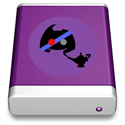
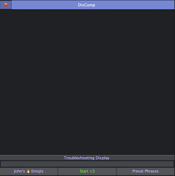

<h1 align="center">  DisComp  </h1> 

<h2 align="center"> Description </h2>

A combination of Discord and Companion, a very rudimentary automation bot. I designed DisComp to make activity leveling in certain discord channels easier while not at your computer.  

This application helped me to gain a better understanding of creating a GUI for a java program as I had never done it before.
I also wanted to create something for my friends and I to use on our discords.  

The UI is straight forward with a text box area to enter your own phrases, a start button, along with a few additional features.  

DisComp will select a time between (1) to (3) minutes to send a random message from your list of phrases into the discord channel you are currently active in.  

It is currently at a working state, so I also included the application compiled into a DMG with the latest version to be used on MacOs.  
Just drag and drop the DisComp app into the Applications folder after mounting.  

 

<h2 align="center"> Features </h2>

* Enter custom phrases
* Troubleshooting Display
* A emoji preset as well as a phrase preset
* Select previously added phrases and use the delete key to remove them

<h2 align="center"> Example </h2> 

 
	 

<h2 align="center"> Future Goal Checklist </h2> 

1. - [ ] Multitasking support
2. - [ ] Allow users to set the random time interval

<h2 align="center"> What I Learned </h2> 

* Basics of Java Swing to help build the GUI, including Jpanel, JFrame, JList, JButton, etc.
* Thread safety using SwingUtilities.invokeLater to safely update UI elements
* implementing javax.swing.Timer to schedule tasks
* using java.awt.Robot to simulate user actions
* Convert .jar into a .app, into a custom DMG