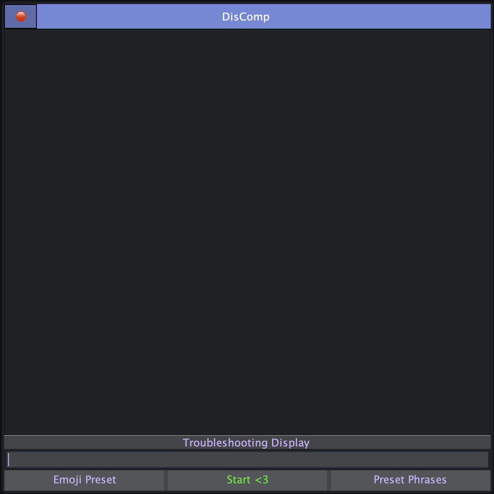

 DisComp  

---

 Description 

---

A very rudimentary automation bot with UI. Designed to make activity leveling in certain discord channels easier while you are afk.

The UI is straight forward with a text box area to enter your own phrases and a start button, with a few additional features.

It takes anywhere between (1) to (3) minutes for the bot to send your message. 

I designed this application to gain a better understanding of creating a GUI for a java program as I had never done it before. 

It is at a working state for what I need it to do, so I also included the application compiled in a DMG with the latest version to be used on MacOs.

 Features 

---

* Enter custom phrases
* Select previously added phrases and use the delete key to remove them
* A random emoji preset as well as a phrase preset
* Troubleshooting Display

 Example 
 

---

 
	 

---

 Goals Checklist 
 

1. - [ ] Allow users to set the random time interval
2. - [ ] Multitasking support, currently the bot requires control of the users keyboard to copy and paste the messages

---

 What I Learned 
 

* Basics of Java Swing to help build the GUI, including Jpanel, JFrame, JList, JButton, etc.
* Thread safety using SwingUtilities.invokeLater to safely update UI elements
* using java.awt.Robot to simulate user actions
* implementing javax.swing.Timer to schedule tasks